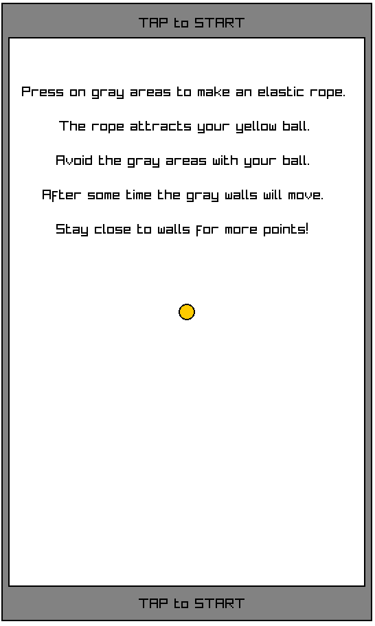
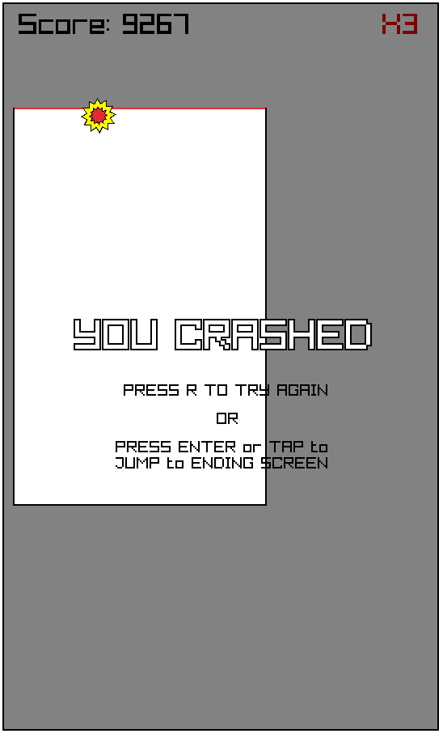
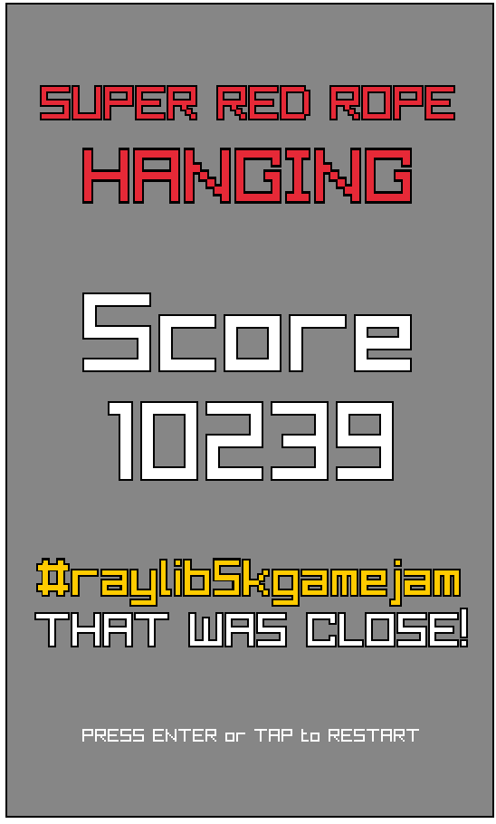

## Super Red Rope Hanging

### Description

Simple game developed in raylib and prepared to be compiled in WebAssembly to be playable on internet browsers. Developed as a quick challenge due to the #raylib5kgamejam (https://itch.io/jam/raylib-5k-gamejam)

It is an arcade game where you have to keep your ball alive by hanging with an elastic red rope. Inspired as a small spinoff of my previous game Super Red Rope Puzzles (https://kurnic.itch.io/super-red-rope-puzzles)

### Features

 - Inducing stress to the player.

### Controls

Mouse:
 - Click on gray areas to create an elastic red rope and control your yellow ball.

### Screenshots

### Developers

 - Kurnic

### Links

 - itch.io Release: https://kurnic.itch.io/super-red-rope-hanging

### License

This game sources are licensed under an unmodified zlib/libpng license, which is an OSI-certified, BSD-like license that allows static linking with closed source software. Check [LICENSE](LICENSE) for further details.

Crash, grab and menu sounds have been created with BFXR (https://www.bfxr.net/)

Audio loops taken out of open source song "Desolation v1.0" by Josh Penn-Pierson (https://github.com/OpenSourceMusic/Desolation)

*Copyright (c) 2022 kurnic*
